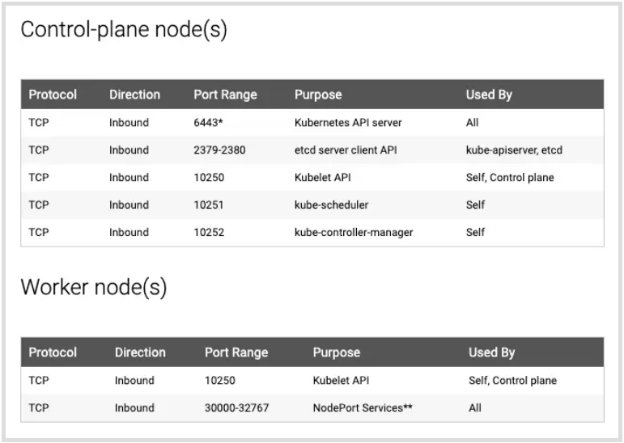

####K8s Cluster Setup using Kubeadm (1 master & 2 Worker nodes)

```
- KUBEADM: Kubeadm is a tool (developed and maintained by the official Kubernetes community) to set up a minimum viable Kubernetes cluster without much complex configuration. 
- Kubeadm makes the whole process easy by running a series of prechecks to ensure that the server has all the essential components and configs to run Kubernetes.
```

1. Prerequisites
2. Port Requirements 
3. Steps 

######1. Setup Prerequisites
```
- Minimum two Ubuntu nodes [One master and one worker node]. You can have more worker nodes as per your requirement.
- The master node should have a minimum of 2 vCPU and 2GB RAM.
- For the worker nodes, a minimum of 1vCPU and 2 GB RAM is recommended.
- 10.X.X.X/X network range with static IPs for master and worker nodes. We will be using the 192 series as the pod network range that will be used by the Calico network plugin. Make sure the Node IP range and pod IP range don’t overlap.
```

#####2. PORT Requirements


    - If you are using vagrant-based Ubuntu VMs, the firewall would be disabled by default. So you don’t have to do any firewall configurations.

####3. Further Steps

```
- launch the machines & after step 1&2 perform these tasks: 
1. Install container runtime on all nodes- We will be using cri-o.
2. Install Kubeadm, Kubelet, and kubectl on all the nodes.
3. Initiate Kubeadm control plane configuration on the master node.
4. Save the node join command with the token.
5. Install the Calico network plugin.
6. Join the worker node to the master node (control plane) using the join command.
7. Validate all cluster components and nodes.
8. Install Kubernetes Metrics Server
9. Deploy a sample app and validate the app
```

Follow this Guide: `https://devopscube.com/setup-kubernetes-cluster-kubeadm/`

#####Errors faced:
```
- metrics-server didn't work with v1.24.6    version 
```


####COURSE


Follow the Official Documentation: `https://kubernetes.io/docs/setup/production-environment/tools/kubeadm/install-kubeadm/`

```
- As root user
- before these check Verify the MAC address and product_uuid are unique for every node, Check required ports, Installing a container runtime, 
>>> sudo apt update -y
>>> sudo apt-get install kubeadm=1.24.0-00 kubelet=1.24.0-00 -y
>>> kubeadm version
>>> kubelet --version
>>> kubeadm init --apiserver-advertise-address=10.8.85.9 --apiserver-cert-extra-sans=controlplane --pod-network-cidr=10.244.0.0/16
        ---- get the apiserver-advertise-address IP from the `ifconfig` eth0 (generally), it is ip of the masternode
        ---- note the kubeadm join token or regenterate using
        >>> kubeadm create token --print-join-command
- run these as regular user
>>> mkdir -p $HOME/.kube
>>> sudo cp -i /etc/kubernetes/admin.conf $HOME/.kube/config
>>> sudo chown $(id -u):$(id -g) $HOME/.kube/config
```


#### Upgrade version of Kubeadm
https://kubernetes.io/docs/tasks/administer-cluster/kubeadm/kubeadm-upgrade/

1. Controlplane
```
>>> kubeadm version
>>> apt-mark unhold kubeadm && \
    apt-get update && apt-get install -y kubeadm=1.24.0-00 && \
    apt-mark hold kubeadm
>>> kubeadm version
>>> kubeadm upgrade plan
>>> sudo kubeadm upgrade apply v1.25.x
>>> kubectl drain <node-to-drain> --ignore-daemonsets
>>> apt-mark unhold kubelet kubectl && \
    apt-get update && apt-get install -y kubelet=1.24.0-00 kubectl=1.24.0-00 && \
    apt-mark hold kubelet kubectl
>>> sudo systemctl daemon-reload
>>> sudo systemctl restart kubelet
>>> kubectl uncordon <node-to-uncordon>
```
2. Worker Nodes: Drain the nodes first
```
>>> apt-mark unhold kubeadm && \
    apt-get update && apt-get install -y kubeadm=1.24.0-00 && \
    apt-mark hold kubeadm
>>> sudo kubeadm upgrade node
>>> kubectl drain <node-to-drain> --ignore-daemonsets
>>> apt-mark unhold kubelet kubectl && \
    apt-get update && apt-get install -y kubelet=1.24.0-00 kubectl=1.24.0-00 && \
    apt-mark hold kubelet kubectl
>>> sudo systemctl daemon-reload
>>> sudo systemctl restart kubelet
>>> kubectl uncordon <node-to-uncordon>
>>> kubectl get nodes
```