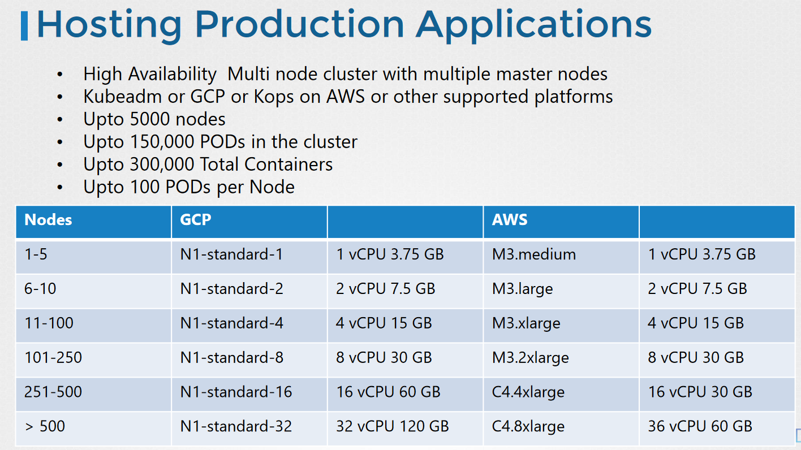

##### Design of K8s Cluster

- Node Considerations
- Resource Requirements
- Network Considerations

##### Ask?

```
1. PURPOSE
    a. Education:
        - Minikube
        - Single node cluster with kubeadm/GCP/AWS
    b. Development & Testing
        - Multi-node cluster with a Single Master and Multiple workers
        - Setup using kubeadm tool or quick provision on GCP or AWS or AKS
    c. Hosting Production Applications
2. CLOUD OR ON-PREMISES?
        - Use Kubeadm for on-prem
        - GKE for GCP
        - Kops for AWS
        - Azure Kubernetes Service(AKS) for Azure
3. WORKLOADS
    a. How many?
    b. What kind?
        - Web
        - Big Data/Analytics
    c. Application Resource Requirements
        - CPU Intensive
        - Memory Intensive
    d. Traffic
        - Heavy traffic
        - Burst Traffic
    e. Storage
        - High Performance – SSD Backed Storage
        - Multiple Concurrent connections – Network based storage
        - Persistent shared volumes for shared access across multiple PODs
        - Label nodes with specific disk types
        - Use Node Selectors to assign applications to nodes with specific disk types
```
//



#### NODES:
- Virtual or Physical Machines
- Minimum of 4 Node Cluster (Size based on workload)
- Master vs Worker Nodes
- Linux X86_64 Architecture
- Master nodes can host workloads
- Best practice is to not host workloads on Master nodes
**Note: When a cluster has multiple control plane maste nodes, etcd can be configured outside controlplane as a separate node. 