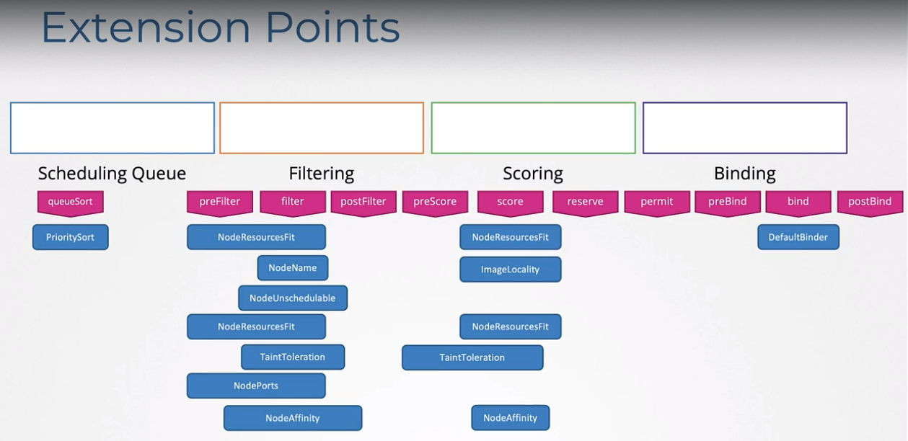

Multiple Schedulars

```
Two Schedulars: Default schedular & Custom-schedular

- When Schedulars are deployed as Service not POD
    - my-schedular-config.yaml
           apiVersion: kubeschedular.config.k8s.io/v1
           kind: KubeSchedularConfiguration
           profiles:
            - schedularName: my-schedular
              plugins:
                score:
                    disabled: 
                    - name: TaintToleration
                    enabled:
                    - name: MyCustomPluginA
                preScore:
                    disabled:
                    - name: '*' 
           leaderElection:
             leaderElect: true
             resourceNamespace: kube-system
             resourceName: lock-object-my-schedular
    - my-schedular-2-config.yaml 
           apiVersion: kubeschedular.config.k8s.io/v1
           kind: KubeSchedularConfiguration
           profiles:
            - schedularName: my-schedular-2
    
    - my-schedular.service
        ExecStart = /usr/local/bin/kube-schedular \\
                --config = /etc/Kubernetes/manifests/myschedular-config.yaml 
    - my-schedular-2.service 
        ExecStart = /usr/local/bin/kube-schedular \\
                --config = /etc/Kubernetes/manifests/my-schedular-2-config.yaml

- Additional Schedulars as a POD - Kubeadm
    my-custom-schdeular.yaml
            api: v1
            kind: Pod
            metadata: 
                name: my-custom-schdeular
                namespace:
            spec:
                containers:
                - command: 
                  - kube-schedular
                  - --address=
                  - --kubeconfig=/etc/kubernetes/schedular.conf
                  - --config=/etc/Kubernetes/manifests/myschedular-config.yaml
                  image:
                  name: kube-schedular  

>>> kubectl get pods
    pod.yaml
            spec:
                schedularName: 
>>> kubectl get events
>>> kubectl logs my-custom-schedular --ns <name-space>

- In case of multiple copies of schedular running on different master node(multiple master nodes) so multiple schedular. If multiple copies of the same schedular is running on all the master nodes, only one can be active at a time. So, the LeaderElect option helps select the leader of scheduling activities. 
- https://kubernetes.io/docs/tasks/extend-kubernetes/configure-multiple-schedulers/
```

CONFIGURING SCHEDULING PROFILES:
```
- 1. Scheduling Queue: A scheduling queue is created with all the pods that needs to be scheduled. [Priority Sort Plugin]
- 2. Sorting PODS: Pods are sorted based on the priority defined in the pod.yamls (spec: priorityClassName: high-priority ----> for this create a PriorityClass object with a value-Integer & name defined)
- 3. Filtering: This is the phase where nodes that cannot run the pod is filtered out (resources/limits, nodeselectors, affinity etc). [Node Resources Fit Plugin, NodeName Plugin, NodeUnschedulable Plugin]
- 4. Scoring Phase: nodes are scored with weights, the schedular associates a score on the basis of the free space it'll have after scheduling (more the space left higher the score). Higher score node gets picked up. [Noderesources Fit, Image Locality Plugin]
- 5. Binding Phase: Pod is Binded with the node by a binidng object. [Default Binder]

- We can write our own plugins & customize what plugins go where.
- The Extension Points help us decide what plugins will be pluged to what phase (queueSort, filtering, scoring, binding)
- https://kubernetes.io/docs/concepts/scheduling-eviction/_print/#kube-scheduler-implementation
```

