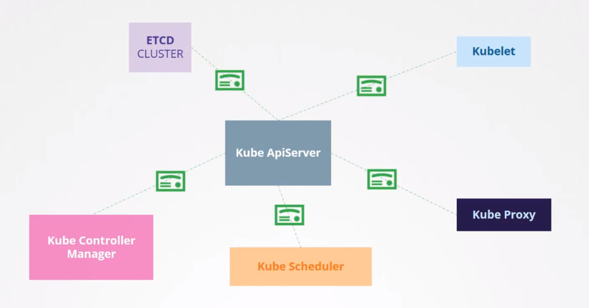

####K8s Security Primitives:

#####1. Secure Hosts (Master & Worker nodes)
    Password Based Authentication Disabled
    SSH Key based Authentication

#####2. Secure the Cluster
    
- Controlling access to `kube-apiserver`

    - Authentication Mechanisms: Who can access the ` kube-apiserver`?
        Files - Usernames & Passwords
        Files - Usernames & Tokens
        Certificates
        External Authentication Providers: LDAP
        Service-Accounts for Machine
    - Authorization Mechanims: What can they do on `kube-apiserver`? 
        RBAC Authorization: Users are associated to groups with specific permissions.
        ABAC Authorization
        Node Authorization
        WebHook Mode
- All communications between various componets is secured through TLS Encryption.

---
####NOTE
- RBAC: Role Based Access Control
- ABAC: Attribute Based Access Control