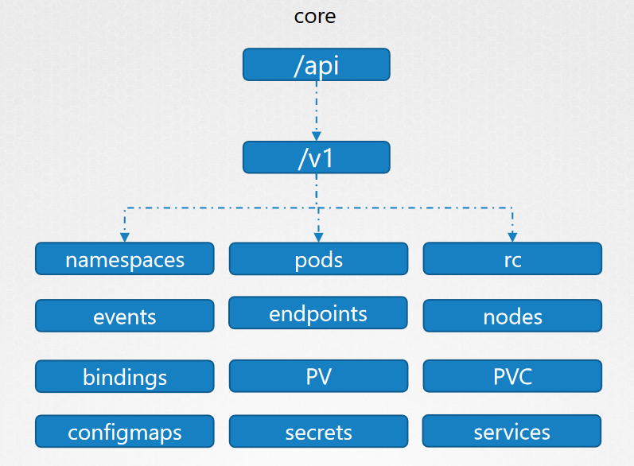
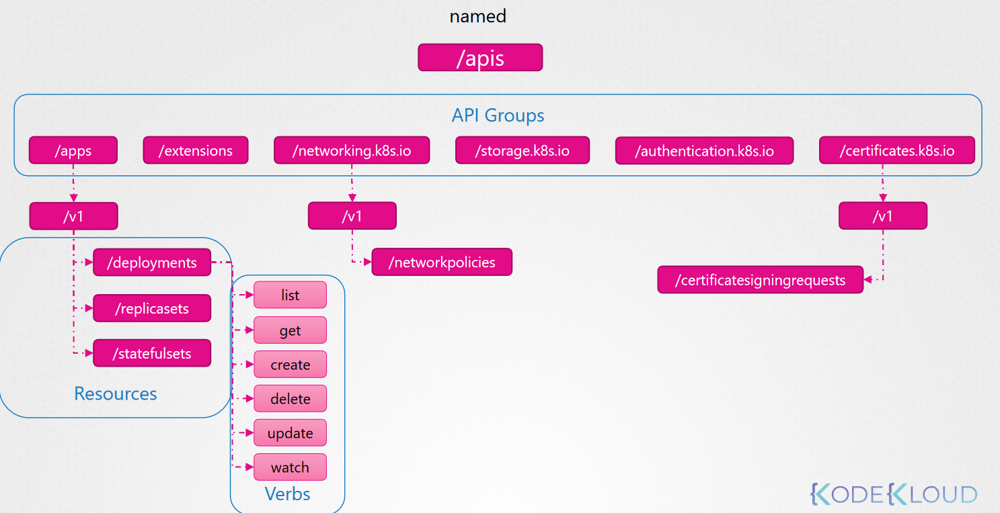

##### API Groups in K8s

- API Groups: K8s API paths are grouped i.e. /version, /api, /healths, /apis, /metrics, /logs.
    ```
    >>> curl https://kube-master:6443/version
    >>> curl https://kube-master:6443/api/v1/pods
    ```
- APIs responsible for cluster functionality are categorzied into two:

1. CORE GROUP: core functionality exists: /api/v1/ 
    i.e. namespaces, pods, rc, events, endpoints, nodes, bindings, PV, PVC, configmaps, secrets, services    ```


2. NAMED GROUP: are more organized & updated ones: /apis
    i.e. /apps, /extensions, /networking.k8s.io, /storage.k8s.io etc.


```
>>> curl http://localhost:6443 -k
      {
        "paths": [
        "/api",
        "/api/v1",
        "/apis",
        "/apis/",
        "/healthz",
        "/logs",
        "/metrics",
        "/openapi/v2",
        "/swagger-2.0.0.json",
>>> curl http://localhost:6443/apis -k | grep “name”
        "name": "extensions",
        "name": "apps",
        "name": "events.k8s.io",
        "name": "authentication.k8s.io",
        "name": "authorization.k8s.io",
        "name": "autoscaling",
        "name": "batch",
        "name": "certificates.k8s.io",
        "name": "networking.k8s.io",
        "name": "policy",
        "name": "rbac.authorization.k8s.io",
        "name": "storage.k8s.io",
        "name": "admissionregistration.k8s.io",
        "name": "apiextensions.k8s.io",
        "name": "scheduling.k8s.io",
>>> curl http://localhost:6443 -k ----- can throw error as no certs are specified
In order to remove this errowr we can either 
    1. specify the certs like this
        >>> curl http://localhost:6443 –k
                --key admin.key
                --cert admin.crt
                --cacert ca.crt
    2. or start a kubectl-proxy client on locally
        >>> kubectl proxy --- launch the kubectl proxy client on 8001 & uses the credentials, certs from kubeconfig file.
        >>> curl http://localhost:8001 -k  --- no error
            {
                "paths": [
                "/api",
                "/api/v1",
                "/apis",
                "/apis/",
                "/healthz",
                "/logs",
                "/metrics",
                "/openapi/v2",
                "/swagger-2.0.0.json",
```
#####NOTE
```
- Kube Proxy & Kubectl Proxy: are not the same.
- Kube-proxy: is use to enable connectivity between pods & services across different nodes in the cluster.
- Kubectl Proxy: It is an HTTP proxy service created by kubectl utility to access the kube-apiserver.
- 
```


